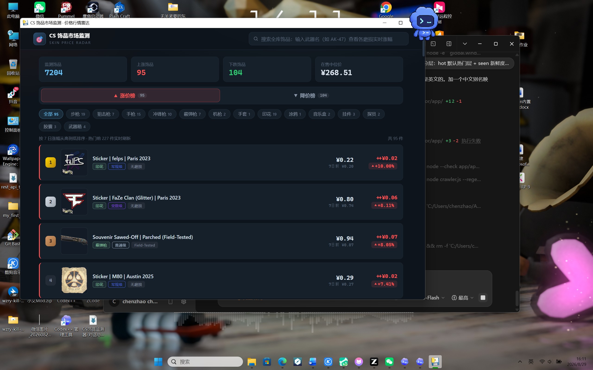

# CS 饰品市场监测 · CS Skin Price Radar

*[中文](README.md) | English*

A **zero-dependency, fully local** desktop app for monitoring CS2 (CS:GO) skin market prices: real prices, per-wear price tables, weapon categories, and gainers/losers boards. Double-click to run (~30 MB, uses the Edge WebView2 runtime that ships with Windows).

> ⚠️ This project is not affiliated with Valve or Steam in any way. Data comes from public Steam Community Market pages and is for personal learning and price reference only — not trading advice.



## Features

- **Gainers / Losers boards**: covers all scraped Steam entries (~7,000+), sorted by 7-day change; gold/silver/bronze badges for the top 3, red for gains and green for losses. The hot pool (~200 items) refreshes daily in real time; third-party reference entries automatically join the boards once 8+ days of history accumulate
- **Full-catalog search**: type a weapon name (e.g. `AK-47` or the Chinese term "爪子刀") → every wear × version of that family in the catalog, sorted by price, each row showing current price and 7-day change. Common Chinese terms are mapped automatically (stickers / patches / agents / music kits / graffiti / charms / cases / capsules…)
- **Per-wear price tables**: the detail page shows real listing prices for the whole skin family — Factory New → Battle-Scarred (plus vanilla) — across **Normal / StatTrak™ / Souvenir**, with the current wear highlighted, price-bar comparison, and click-through to that exact version
- **Category system**: rifles / snipers / pistols / SMGs / shotguns / machine guns / knives / gloves, plus stickers, graffiti, music kits, charms, patches, agents, capsules and weapon cases — one-click filter chips on the boards page
- **Detail page**: all-time low / current / all-time high cards + ECharts trend chart (7 / 30 / 90 days / all)
- **External data**: drop a `data.js` next to the exe and it loads automatically — **refresh market data without repackaging**

## Data Notes (Important)

| Data | Source | Freshness |
|---|---|---|
| Current price / wear-tier listings / category / images | Public Steam Market endpoints | Hot pool refreshed daily; full catalog as of the last deep crawl |
| **Third-party reference prices** (detail page) | [Skinport](https://docs.skinport.com/), [market.csgo.com](https://market.csgo.com/en/api), Waxpeer public APIs | Synced on every crawler run (1 request per source); the detail page shows the spread vs. Steam |
| Unified item catalog | Union of third-party catalogs (~30,000 entries) | Used for coverage accounting and deep-crawl gap detection |
| Price history | Daily snapshots in `cache/price-history.json` | **Grows more real over time**; items with < 8 days of history fall back to a locally simulated trend (labeled in the UI) |
| 7-day change | Computed from price history | Real once ≥ 8 days of snapshots exist; simulated before that |

- **Multi-source principle**: Steam listing prices are the only market benchmark (this app's stance). Third-party spot-market prices (Skinport / market.csgo / Waxpeer) are real-currency cash prices, typically 20–30% below Steam wallet prices, shown on the detail page as cross-platform reference only — always labeled, never mixed with Steam prices
- Exchange rate: fixed USD → CNY at `7.25` (adjustable via `--rate`); not directly comparable with quotes from Chinese platforms (BUFF / YouPin)
- Want real history right away? See "Optional: real history layer" below

## Quick Start

### Regular users

Download `CSSkinMonitor.exe` from the releases page (or build it yourself) and double-click to run. To refresh prices:

```
node crawler.js            # hot tier, ~2 minutes
node crawler.js --regen    # rebuild app/data.js
# copy app/data.js next to the exe and restart the app
```

> **First step after cloning**: run `node crawler.js` + `node crawler.js --regen` to generate `app/data.js` (the data file is a build artifact and is not committed).

### Requirements

- Node.js ≥ 16 (the crawler uses only Node built-ins + system `curl`)
- Python 3.10+ (only needed to build the exe; `pip install -r requirements.txt`)
- Windows 10+ (WebView2 ships with the OS)

### Building

```
python -m PyInstaller --onefile --windowed --name CSSkinMonitor --add-data "app;app" main.py
```

## Crawler Design (Tiered)

```
node crawler.js                      # hot tier: top 200 trending on Steam, ~2 min; boards data source + daily snapshot
node crawler.js --mode weapons       # deep tier: all 34 weapons (Normal/StatTrak/Souvenir × every wear)
node crawler.js --mode knives        # deep tier: 20 knife + 8 glove families
node crawler.js --mode collect       # deep tier: stickers/graffiti/music kits/charms/patches/agents/capsules/cases
node crawler.js --regen              # offline rebuild of data.js (no network, no price refresh)
node crawler.js --reset              # clear cache and start over
```

- **Why tiers**: a full crawl of ~35,000 market entries takes hours; real attention concentrates on the hot pool, so the deep tier runs occasionally to fill gaps
- **Multi-source catalog** (`sources.js`): each run fetches one public price list each from Skinport / market.csgo.com / Waxpeer (3 requests ≈ ~30,000 entries), builds the `cache/catalog.json` union + coverage report, and supplies third-party reference prices for the detail page; a failed source is skipped automatically
- **Resume support**: progress is persisted to `cache/crawler-cache.json`; re-running after an interruption picks up where it left off, and existing entries only get price refreshes
- **Rate limiting**: 3.5 s/request for list pages, 3 s/request for history, with exponential-backoff retries (3 attempts) on failure
- **Pagination fix**: Steam ignores the `count` parameter and always returns ~10 items/page → the crawler advances adaptively based on the actual response size
- **Wear price library**: `WEARDB[skin family] = { cat, w: Normal, st: StatTrak™, sv: Souvenir }`, keyed `fn/mw/ft/ww/bs/van`
- **Filter parameter caveat**: Steam ignores `category_730_*` filters when not logged in → collectibles use keyword search + a `type` field for classification

### Optional: real history layer (off by default)

Steam's `pricehistory` endpoint requires a logged-in session. If you're willing to use **your own account session** to backfill real history (compliance terms: your session only, only public price data visible to you, 3 s rate limit):

```
# replace STEAM_COMMUNITY_COOKIE with the steamcommunity.com cookie value from your browser
set STEAM_COMMUNITY_COOKIE=steamLoginSecure=xxxxx...
node crawler.js --history 200          # fetch real price history for the top 200 hot-pool items
node crawler.js --regen
```

Add `--hist-usd` if your Steam wallet is in USD (CNY is the default). Without this, nothing breaks — history simply accumulates via daily snapshots.

**Login-free backfill for third-party entries**: Skinport's public sales history (24h/7d/30d/90d median prices) can immediately build real movement for third-party entries:

```
node crawler.js --pages 0 --backfill 2000   # prioritized by 7-day volume (batches of 100 names, 40 s throttle; ~13 min for 2,000)
node crawler.js --regen
```

- Backfilled entries immediately get **real** change classification and join the boards; low-liquidity items with fewer than 3 sales in 7 days stay at "no data" (median unreliable)
- Backfill progress is tracked in `cache/catalog.json` (`histAt`) and resumes automatically; the full ~19,000 entries take roughly one night (~2 hours)

## Compliance

- Follows [steamcommunity.com/robots.txt](https://steamcommunity.com/robots.txt): the `/market/search/render/` endpoint used by this project is not on the disallow list
- Third-party markets are accessed only via their official documented APIs (Skinport / market.csgo.com / Waxpeer), respecting their documented rate limits (Skinport allows 8 requests per 5 minutes; this project sends 1 per run), with sources clearly labeled in the app
- No login, no bypassing of any access control; all data is public — equally visible in a browser anonymously (or via your own account)
- Fixed rate limits + retry backoff; no unreasonable load on any service. Please do not remove or weaken the rate-limit parameters for bulk scraping
- Item images are owned by Valve; this repository does not host them (they load from the Steam CDN at runtime or a local cache, for personal use only)
- Do not use this project's data for commercial resale; any use of this project is at your own responsibility

## Project Layout

```
cs-skin-monitor/
├── main.py                      # pywebview entry (launch route args + external data.js override)
├── crawler.js                   # tiered crawler (hot/weapons/knives/collectibles + wear library + snapshots + multi-source catalog)
├── sources.js                   # third-party market sources (Skinport / market.csgo.com / Waxpeer, public APIs)
├── scan-tradeup.js              # daily trade-up radar (extreme-recipe scan across collections × tiers)
├── build-tradeup.js             # trade-up metadata builder (collections/float ranges/gold pool, bilingual)
├── build-names.js               # Chinese item-name mapping builder (ByMykel zh-CN, 8 endpoints)
├── regression.js                # regression tests (data-layer assertions + route rendering checks, npm test)
├── crawler-templates/engine.js  # runtime engine (real history hookup / three boards / categories / SVG fallback)
├── app/                         # frontend (vanilla HTML/CSS/JS + local ECharts, no build step)
│   ├── index.html / styles.css
│   ├── js/                      # modular frontend (core/router/views-list/fav/alchemy/detail/boot)
│   └── data.js                  # crawler-generated (RAW + WEARDB + HISTORY + TRADEUP + engine, not committed)
├── cache/                       # crawler cache + daily price snapshots + multi-source catalog (gitignored)
└── requirements.txt
```

## Tech Choices

- **Packaging**: pywebview + PyInstaller (over Electron — 1/7 the size; reuses the system WebView2)
- **Charts**: ECharts 5 embedded locally, fully offline
- **Crawler**: Node + spawned curl (Steam rejects Node TLS fingerprints; curl works)
- **Frontend**: vanilla JS SPA, hash routing, long lists rendered 60 rows/batch + IntersectionObserver lazy loading

## Roadmap

- [ ] Auto-switching boards explanation once real history accumulates
- [ ] Price alerts (webhooks)
- [ ] Multi-currency support
- [ ] Scheduled deep-tier crawl examples (Windows Task Scheduler / cron)

## Acknowledgments

- [scm-price-history](https://github.com/HilliamT/scm-price-history) — login-free price-history idea (verified broken after a Steam redesign; this project switched to daily snapshot accumulation + the optional official pricehistory endpoint)
- [cs2-price-tracker](https://github.com/spratap124/cs2-price-tracker) — rate-limit/backoff/cache practices
- [awesome-cs2-trading](https://github.com/redlfox/awesome-cs2-trading) — CS2 trading tools collection

## License

[MIT](LICENSE)
